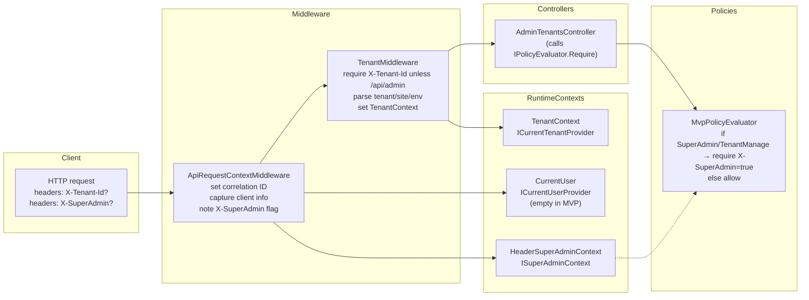

# API Authentication

This note captures the current API authentication/authorization setup and the near-term roadmap to harden it.

## Current State (MVP)
- Transport is open; no JWT/Bearer middleware is configured. Authentication is simulated via HTTP headers.
- SuperAdmin detection is header-based: `X-SuperAdmin: true` populates `ISuperAdminContext` (`HeaderSuperAdminContext` in `Program.cs`). Missing/false means no superadmin rights.
- Permission checks use `IPolicyEvaluator` → `MvpPolicyEvaluator`. Only `AdminPermissions.SuperAdmin` and `AdminPermissions.TenantManage` are enforced; all other permissions currently allow-pass (placeholder until RBAC is wired).
- Tenant scoping is enforced for non-admin routes by `TenantMiddleware`: requires `X-Tenant-Id` (GUID) and hydrates `TenantContext`/`ICurrentTenantProvider`. Admin routes (`/api/admin/*`) bypass tenant headers.
- User identity is not yet resolved: `CurrentUser` (`ICurrentUserProvider`) exists but is never populated by an auth handler, so `UserId/Roles/Permissions` remain empty.
- Request context middleware adds correlation ID, client IP, user agent, and exposes superadmin/tenant/user contexts to downstream code.
- Swagger is enabled in Development with no auth scheme declared; endpoints are effectively anonymous aside from header checks above.

### Swimlane (current flow)

## Future Roadmap
- Introduce JWT Bearer authentication (ASP.NET Core) with issuer/audience validation, signing keys, clock skew limits, and HTTPS-only metadata fetch.
- Map JWT claims into `CurrentUser` (id, username, roles, permissions/scopes) and `ISuperAdminContext` (e.g., `role=superadmin` or dedicated claim) instead of headers.
- Replace header-based permission stubs with real RBAC/ABAC in `IPolicyEvaluator`, backed by role/permission claims and policy configuration (aligned to ADR-004, ADR-011).
- Move tenant resolution to claims + fallback header: prefer `tenant_id` (and optionally `site_id`, `environment`) claims; keep admin routes tenant-agnostic.
- Add Swagger/OpenAPI security definition (Bearer) and require authorization globally, with per-endpoint permission annotations where appropriate.
- Harden middleware ordering: authenticate → set request context → authorize → tenant resolution for non-admin routes.
- Extend token story: support service-to-service tokens, key rotation, environment-specific signing keys, and short-lived access tokens with refresh tokens issued by Identity provider (not the API host).
- Telemetry and audit: log auth failures, permission denials, and tenant resolution outcomes (ties to ADR-013).
