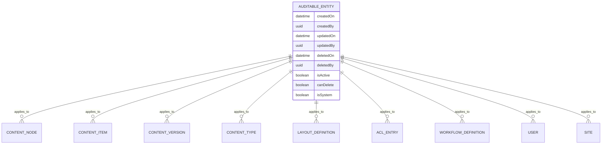

```mermaid
erDiagram

  TENANT ||--o{ SITE : has
  TENANT ||--o{ USER : has
  TENANT ||--o{ ROLE : has
  TENANT ||--o{ GROUP : has

  USER ||--o{ USER_ROLE : assigned
  ROLE ||--o{ USER_ROLE : contains

  USER ||--o{ USER_GROUP : member
  GROUP ||--o{ USER_GROUP : contains

  TENANT ||--o{ CONTENT_TYPE : defines
  CONTENT_TYPE ||--o{ CONTENT_TYPE_FIELD : has

  SITE ||--o{ CONTENT_NODE : contains
  CONTENT_NODE ||--o{ CONTENT_NODE : parent_of

  CONTENT_TYPE ||--o{ CONTENT_ITEM : instances
  TENANT ||--o{ CONTENT_ITEM : owns
  SITE ||--o{ CONTENT_ITEM : scoped

  CONTENT_ITEM ||--o{ CONTENT_VERSION : versions
  CONTENT_VERSION ||--o{ CONTENT_FIELD_VALUE : values

  CONTENT_VERSION ||--o{ CONTENT_LAYOUT : layout
  LAYOUT_DEFINITION ||--o{ CONTENT_LAYOUT : template
  TENANT ||--o{ LAYOUT_DEFINITION : defines
  TENANT ||--o{ COMPONENT_DEFINITION : defines

  SITE ||--o{ ROUTE : has
  CONTENT_NODE ||--o{ ROUTE : resolves_to

  TENANT ||--o{ ACL_ENTRY : secures
  SITE ||--o{ ACL_ENTRY : secures
  CONTENT_NODE ||--o{ ACL_ENTRY : secures
  CONTENT_TYPE ||--o{ ACL_ENTRY : secures
  ROLE ||--o{ ACL_ENTRY : granted_to
  GROUP ||--o{ ACL_ENTRY : granted_to
  USER ||--o{ ACL_ENTRY : granted_to

  WORKFLOW_DEFINITION ||--o{ WORKFLOW_STATE : has
  WORKFLOW_STATE ||--o{ WORKFLOW_TRANSITION : "has transitions"
  TENANT ||--o{ WORKFLOW_DEFINITION : defines
  CONTENT_VERSION }o--|| WORKFLOW_STATE : current_state

  TENANT ||--o{ PREVIEW_TOKEN : issues
  PREVIEW_TOKEN }o--|| CONTENT_VERSION : previews
  PREVIEW_TOKEN }o--|| SITE : for_site
  PREVIEW_TOKEN }o--|| CONTENT_NODE : for_node

  TENANT ||--o{ AUDIT_LOG : records
  USER ||--o{ AUDIT_LOG : actor

  TENANT ||--o{ MODULE : hosts
  MODULE ||--o{ MODULE_CAPABILITY : has
  MODULE ||--o{ MODULE_SETTING : configured_by
  MODULE ||--o{ MODULE_MIGRATION : migrated_by
  
  MODULE ||--o{ ENTITY_DEFINITION : defines
  ENTITY_DEFINITION ||--o{ ENTITY_INSTANCE : instances
  ENTITY_INSTANCE ||--o{ ENTITY_INSTANCE : parent_of
  ENTITY_INSTANCE ||--o{ ENTITY_RELATIONSHIP : source_of
  ENTITY_INSTANCE ||--o{ ENTITY_RELATIONSHIP : target_of
  
  MODULE ||--o{ PROCESS_DEFINITION : defines
  PROCESS_DEFINITION ||--o{ PROCESS_INSTANCE : runs
  ENTITY_INSTANCE ||--o{ PROCESS_INSTANCE : tracked_by
  
  MODULE ||--o{ ATTACHMENT : stores
  ENTITY_INSTANCE ||--o{ ATTACHMENT : has
  MODULE ||--o{ COMMENT : enables
  ENTITY_INSTANCE ||--o{ COMMENT : has
  MODULE ||--o{ ACTIVITY_LOG : tracks
  ENTITY_INSTANCE ||--o{ ACTIVITY_LOG : logged
  
  MODULE ||--o{ SEARCH_INDEX_ENTRY : indexes
  ENTITY_INSTANCE ||--o{ SEARCH_INDEX_ENTRY : indexed_as
  CONTENT_ITEM ||--o{ SEARCH_INDEX_ENTRY : indexed_as
  
  TENANT ||--o{ TAG : manages
  MODULE ||--o{ TAG : categorizes
  TAG ||--o{ ENTITY_TAG : applied_to
  ENTITY_INSTANCE ||--o{ ENTITY_TAG : tagged_with
  
  MODULE ||--o{ NOTIFICATION_TEMPLATE : provides
  NOTIFICATION_TEMPLATE ||--o{ NOTIFICATION_QUEUE : generates
  USER ||--o{ NOTIFICATION_QUEUE : receives
  
  MODULE ||--o{ FEATURE_FLAG : controls
  TENANT ||--o{ FEATURE_FLAG : manages

  TENANT {
    uuid id PK
    string name
    string status
    datetime createdOn
    uuid createdBy
    datetime updatedOn
    uuid updatedBy
    datetime deletedOn "nullable"
    uuid deletedBy "nullable"
    boolean isDeleted
    boolean isActive
    boolean canDelete
    boolean isSystem
  }

  SITE {
    uuid id PK
    uuid tenantId FK
    string name
    string hostName
    string defaultLocale
    datetime createdOn
    uuid createdBy
    datetime updatedOn
    uuid updatedBy
    datetime deletedOn "nullable"
    uuid deletedBy "nullable"
    boolean isDeleted
    boolean isActive
    boolean canDelete
    boolean isSystem
  }

  USER {
    uuid id PK
    uuid tenantId FK
    string email
    string displayName
    string status
    datetime createdOn
    uuid createdBy
    datetime updatedOn
    uuid updatedBy
    datetime deletedOn "nullable"
    uuid deletedBy "nullable"
    boolean isDeleted
    boolean isActive
    boolean canDelete
    boolean isSystem
  }

  ROLE {
    uuid id PK
    uuid tenantId FK
    string name
    datetime createdOn
    uuid createdBy
    datetime updatedOn
    uuid updatedBy
    datetime deletedOn "nullable"
    uuid deletedBy "nullable"
    boolean isDeleted
    boolean isActive
    boolean canDelete
    boolean isSystem
  }

  GROUP {
    uuid id PK
    uuid tenantId FK
    string name
    datetime createdOn
    uuid createdBy
    datetime updatedOn
    uuid updatedBy
    datetime deletedOn "nullable"
    uuid deletedBy "nullable"
    boolean isDeleted
    boolean isActive
    boolean canDelete
    boolean isSystem
  }

  USER_ROLE {
    uuid tenantId FK
    uuid userId FK
    uuid roleId FK
    datetime createdOn
    uuid createdBy
    datetime updatedOn
    uuid updatedBy
    datetime deletedOn "nullable"
    uuid deletedBy "nullable"
    boolean isDeleted
    boolean isActive
    boolean canDelete
    boolean isSystem
  }

  USER_GROUP {
    uuid tenantId FK
    uuid userId FK
    uuid groupId FK
    datetime createdOn
    uuid createdBy
    datetime updatedOn
    uuid updatedBy
    datetime deletedOn "nullable"
    uuid deletedBy "nullable"
    boolean isDeleted
    boolean isActive
    boolean canDelete
    boolean isSystem
  }

  CONTENT_NODE {
    uuid id PK
    uuid tenantId FK
    uuid siteId FK
    uuid parentId FK
    string nodeType  "Folder|Item|Link|Mount"
    uuid contentItemId "nullable"
    string title
    string path
    int sortOrder
    boolean inheritAcl
    datetime createdOn
    uuid createdBy
    datetime updatedOn
    uuid updatedBy
    datetime deletedOn "nullable"
    uuid deletedBy "nullable"
    boolean isDeleted
    boolean isActive
    boolean canDelete
    boolean isSystem
  }

  ROUTE {
    uuid id PK
    uuid tenantId FK
    uuid siteId FK
    uuid nodeId FK
    string routePath
    boolean isPrimary
    datetime createdOn
    uuid createdBy
    datetime updatedOn
    uuid updatedBy
    datetime deletedOn "nullable"
    uuid deletedBy "nullable"
    boolean isDeleted
    boolean isActive
    boolean canDelete
    boolean isSystem
  }

  CONTENT_TYPE {
    uuid id PK
    uuid tenantId FK
    string typeKey  "e.g. page.article"
    string displayName
    int schemaVersion
    json settingsJson
    datetime createdOn
    uuid createdBy
    datetime updatedOn
    uuid updatedBy
    datetime deletedOn "nullable"
    uuid deletedBy "nullable"
    boolean isDeleted
    boolean isActive
    boolean canDelete
    boolean isSystem
  }

  CONTENT_TYPE_FIELD {
    uuid id PK
    uuid tenantId FK
    uuid contentTypeId FK
    string fieldKey
    string dataType  "string|richtext|number|bool|datetime|ref|json"
    boolean isRequired
    boolean isLocalized
    json constraintsJson
    int sortOrder
    datetime createdOn
    uuid createdBy
    datetime updatedOn
    uuid updatedBy
    datetime deletedOn "nullable"
    uuid deletedBy "nullable"
    boolean isDeleted
    boolean isActive
    boolean canDelete
    boolean isSystem
  }

  CONTENT_ITEM {
    uuid id PK
    uuid tenantId FK
    uuid siteId FK
    uuid contentTypeId FK
    string status "active|archived"
    datetime createdOn
    uuid createdBy
    datetime updatedOn
    uuid updatedBy
    datetime deletedOn "nullable"
    uuid deletedBy "nullable"
    boolean isDeleted
    boolean isActive
    boolean canDelete
    boolean isSystem
  }

  CONTENT_VERSION {
    uuid id PK
    uuid tenantId FK
    uuid contentItemId FK
    int versionNumber
    string lifecycle "draft|review|published|archived"
    uuid workflowStateId "nullable"
    datetime publishedAt "nullable"
    datetime createdOn
    uuid createdBy
    datetime updatedOn
    uuid updatedBy
    datetime deletedOn "nullable"
    uuid deletedBy "nullable"
    boolean isDeleted
    boolean isActive
    boolean canDelete
    boolean isSystem
  }

  CONTENT_FIELD_VALUE {
    uuid id PK
    uuid tenantId FK
    uuid contentVersionId FK
    string fieldKey
    string locale "nullable"
    json valueJson
    datetime createdOn
    uuid createdBy
    datetime updatedOn
    uuid updatedBy
    datetime deletedOn "nullable"
    uuid deletedBy "nullable"
    boolean isDeleted
    boolean isActive
    boolean canDelete
    boolean isSystem
  }

  LAYOUT_DEFINITION {
    uuid id PK
    uuid tenantId FK
    string layoutKey
    string displayName
    json regionsRulesJson
    int version
    datetime createdOn
    uuid createdBy
    datetime updatedOn
    uuid updatedBy
    datetime deletedOn "nullable"
    uuid deletedBy "nullable"
    boolean isDeleted
    boolean isActive
    boolean canDelete
    boolean isSystem
  }

  COMPONENT_DEFINITION {
    uuid id PK
    uuid tenantId FK
    string componentKey
    string displayName
    json propsSchemaJson
    string ownerModule
    int version
    datetime createdOn
    uuid createdBy
    datetime updatedOn
    uuid updatedBy
    datetime deletedOn "nullable"
    uuid deletedBy "nullable"
    boolean isDeleted
    boolean isActive
    boolean canDelete
    boolean isSystem
  }

  CONTENT_LAYOUT {
    uuid id PK
    uuid tenantId FK
    uuid contentVersionId FK
    uuid layoutDefinitionId "nullable"
    json compositionJson  "regions->components->props"
    datetime createdOn
    uuid createdBy
    datetime updatedOn
    uuid updatedBy
    datetime deletedOn "nullable"
    uuid deletedBy "nullable"
    boolean isDeleted
    boolean isActive
    boolean canDelete
    boolean isSystem
  }

  ACL_ENTRY {
    uuid id PK
    uuid tenantId FK
    string scopeType "Tenant|Site|Node|ContentType"
    uuid scopeId
    string principalType "User|Role|Group"
    uuid principalId
    string effect "Allow|Deny"
    string actionsCsv "Read,Edit,Publish,..."
    datetime createdOn
    uuid createdBy
    datetime updatedOn
    uuid updatedBy
    datetime deletedOn "nullable"
    uuid deletedBy "nullable"
    boolean isDeleted
    boolean isActive
    boolean canDelete
    boolean isSystem
  }

  WORKFLOW_DEFINITION {
    uuid id PK
    uuid tenantId FK
    string workflowKey
    string displayName
    boolean isDefault
    datetime createdOn
    uuid createdBy
    datetime updatedOn
    uuid updatedBy
    datetime deletedOn "nullable"
    uuid deletedBy "nullable"
    boolean isDeleted
    boolean isActive
    boolean canDelete
    boolean isSystem
  }

  WORKFLOW_STATE {
    uuid id PK
    uuid tenantId FK
    uuid workflowDefinitionId FK
    string stateKey
    string displayName
    boolean isTerminal
    datetime createdOn
    uuid createdBy
    datetime updatedOn
    uuid updatedBy
    datetime deletedOn "nullable"
    uuid deletedBy "nullable"
    boolean isDeleted
    boolean isActive
    boolean canDelete
    boolean isSystem
  }

  WORKFLOW_TRANSITION {
    uuid id PK
    uuid tenantId FK
    uuid workflowDefinitionId FK
    uuid fromStateId FK
    uuid toStateId FK
    string requiredAction "Approve|Publish|..."
    datetime createdOn
    uuid createdBy
    datetime updatedOn
    uuid updatedBy
    datetime deletedOn "nullable"
    uuid deletedBy "nullable"
    boolean isDeleted
    boolean isActive
    boolean canDelete
    boolean isSystem
  }

  PREVIEW_TOKEN {
    uuid id PK
    uuid tenantId FK
    uuid siteId FK
    uuid nodeId FK
    uuid contentVersionId FK
    string tokenHash "HMAC-SHA256"
    datetime expiresAt
    string issuedToEmail "nullable"
    boolean oneTimeUse
    datetime usedAt "nullable"
    datetime createdOn
    uuid createdBy
    boolean isActive
  }

  AUDIT_LOG {
    uuid id PK
    uuid tenantId FK
    uuid actorUserId FK "nullable"
    string actionKey
    string entityType
    uuid entityId
    json detailsJson
    datetime createdOn
  }

  MODULE {
    uuid id PK
    uuid tenantId FK
    string moduleKey
    string displayName
    string version
    string installationStatus
    datetime installedOn
    json dependenciesJson
    datetime createdOn
    datetime updatedOn
    boolean isActive
    boolean isSystem
  }

  MODULE_CAPABILITY {
    uuid id PK
    uuid tenantId FK
    uuid moduleId FK
    string capabilityKey
    boolean isEnabled
    string licenseTier
  }

  MODULE_SETTING {
    uuid id PK
    uuid tenantId FK
    uuid moduleId FK
    uuid siteId FK "nullable"
    string settingKey
    json settingValue
    boolean isEncrypted
  }

  MODULE_MIGRATION {
    uuid id PK
    uuid tenantId FK
    uuid moduleId FK
    string migrationName
    string fromVersion
    string toVersion
    string status
    datetime appliedOn
  }

  ENTITY_DEFINITION {
    uuid id PK
    uuid tenantId FK
    uuid moduleId FK
    string entityKey
    string displayName
    json schemaJson
    boolean supportsVersioning
    boolean supportsWorkflow
    datetime createdOn
    datetime updatedOn
    boolean isActive
  }

  ENTITY_INSTANCE {
    uuid id PK
    uuid tenantId FK
    uuid siteId FK
    uuid entityDefinitionId FK
    string instanceKey
    string displayName
    string status
    json dataJson
    uuid parentInstanceId FK "nullable"
    datetime createdOn
    datetime updatedOn
    boolean isDeleted
    boolean isActive
  }

  ENTITY_RELATIONSHIP {
    uuid id PK
    uuid tenantId FK
    uuid sourceInstanceId
    uuid targetInstanceId
    string relationshipType
    string relationshipName
    json metadataJson
    datetime createdOn
  }

  PROCESS_DEFINITION {
    uuid id PK
    uuid tenantId FK
    uuid moduleId FK
    string processKey
    string processType
    json statesJson
    json transitionsJson
    boolean hasSla
    datetime createdOn
    boolean isActive
  }

  PROCESS_INSTANCE {
    uuid id PK
    uuid tenantId FK
    uuid processDefinitionId FK
    uuid entityInstanceId
    string currentState
    string status
    datetime startedOn
    datetime dueOn
    datetime completedOn
    json contextDataJson
  }

  ATTACHMENT {
    uuid id PK
    uuid tenantId FK
    uuid moduleId FK
    uuid entityInstanceId
    string fileName
    bigint fileSizeBytes
    string mimeType
    string storagePath
    string scanStatus
    datetime createdOn
    boolean isDeleted
  }

  COMMENT {
    uuid id PK
    uuid tenantId FK
    uuid entityInstanceId
    uuid parentCommentId FK "nullable"
    text commentText
    boolean isInternal
    datetime createdOn
    uuid createdBy FK
    boolean isDeleted
  }

  ACTIVITY_LOG {
    uuid id PK
    uuid tenantId FK
    uuid moduleId FK
    uuid entityInstanceId
    string activityType
    string activityKey
    uuid actorUserId FK
    string fieldChanged
    text oldValue
    text newValue
    datetime occurredOn
  }

  SEARCH_INDEX_ENTRY {
    uuid id PK
    uuid tenantId FK
    uuid siteId FK
    uuid moduleId FK
    uuid entityInstanceId
    string title
    text fullText
    tsvector searchableText
    string visibility
    boolean isPublished
    datetime indexedOn
  }

  TAG {
    uuid id PK
    uuid tenantId FK
    uuid moduleId FK "nullable"
    string tagName
    string tagSlug
    int usageCount
    datetime createdOn
    boolean isActive
  }

  ENTITY_TAG {
    uuid id PK
    uuid tenantId FK
    uuid tagId FK
    uuid entityInstanceId
    datetime createdOn
  }

  NOTIFICATION_TEMPLATE {
    uuid id PK
    uuid tenantId FK
    uuid moduleId FK
    string templateKey
    text emailSubjectTemplate
    text emailBodyTemplate
    string locale
    datetime createdOn
    boolean isActive
  }

  NOTIFICATION_QUEUE {
    uuid id PK
    uuid tenantId FK
    uuid notificationTemplateId FK
    uuid recipientUserId FK
    string channel
    json templateDataJson
    string status
    datetime scheduledFor
    datetime sentAt
    datetime createdOn
  }

  FEATURE_FLAG {
    uuid id PK
    uuid tenantId FK
    uuid moduleId FK
    string flagKey
    boolean isEnabled
    int rolloutPercentage
    datetime validFrom
    datetime validUntil
  }
```

# db-design.md — ContentOS Core Database Design (PostgreSQL)

This document defines the **core relational schema + key indexes** for **TechWayFit ContentOS**.
ContentOS is designed to be **lightweight, high-performance, API-first, secure-by-default, multi-tenant**, and **module-driven**—with complexity added only when needed.

---

## Design principles

### 1) Core-first, module-driven
- The **Core** provides stable primitives: tenancy, identity, content modeling, versioning, hierarchy, layout composition, permissions, workflow, preview, audit.
- Modules (e.g., Blog/Forge) extend via **ContentTypes, Components, Events**, not by modifying core tables.

### 2) Multi-tenant everywhere
- Every row is scoped by `tenantId` (and often `siteId`).
- Guarantees: **no cross-tenant reads/writes** even if bugs exist in higher layers.

### 3) API-first, UI-optional
- Database stores **content + layout as data**, not UI-specific structures.
- Authoring UI (“Studio”) remains optional; APIs are the primary contract.

### 4) Separation of concerns
- **Tree navigation** (ContentNode) is separate from **content data** (ContentItem/Version/FieldValues).
- **Layout composition** is separate from content fields.
- **Workflow** and **ACL** are separate from content storage but attach cleanly.

### 5) Fast reads, safe writes
- Delivery APIs focus on reading **published** content quickly.
- Writes (draft/review/publish) are versioned, auditable, and policy-controlled.

### 6) Security-by-default
- **ACL + workflow + audit** are first-class tables.
- Preview uses **short-lived token hashes** (no raw token storage).

### 7) JSON only where it helps
- JSON is used for: layout composition, field values, component schemas, settings.
- Relational columns remain for: joins, filters, uniqueness, integrity.

---

## Table-by-table design

> Types shown are conceptual; implement as `uuid`, `text`, `boolean`, `int`, `timestamptz`, `jsonb`.

### TENANT
**Purpose:** Top-level isolation boundary.
- Holds tenant identity and lifecycle state.

Key columns:
- `id (PK)`, `name`, `status`
- `createdOn`, `createdBy`, `updatedOn`, `updatedBy`
- `deletedOn`, `deletedBy`, `isDeleted`, `isActive`
- `canDelete`, `isSystem`

---

### SITE
**Purpose:** Multi-site within a tenant (hostnames, locales, delivery scope).
- Enables tenant to host multiple sites/apps with separate trees/routes.

Key columns:
- `id (PK)`, `tenantId (FK → TENANT.id ON DELETE CASCADE)`, `name`, `hostName`, `defaultLocale`
- `createdOn`, `createdBy`, `updatedOn`, `updatedBy`
- `deletedOn`, `deletedBy`, `isDeleted`, `isActive`
- `canDelete`, `isSystem`

Constraints:
- `UNIQUE (tenantId, hostName)` WHERE `deletedOn IS NULL`

---

### USER
**Purpose:** Core identity record (auth handled externally later via IdP).
- Stores minimal identity info needed for permissions and audit.
- MVP: Basic user record; Future: Federated identity via IdP (Auth0, Entra ID)

Key columns:
- `id (PK)`, `tenantId (FK → TENANT.id ON DELETE CASCADE)`, `email`, `displayName`, `status`
- `createdOn`, `createdBy`, `updatedOn`, `updatedBy`
- `deletedOn`, `deletedBy`, `isDeleted`, `isActive`
- `canDelete`, `isSystem`

Constraints:
- `UNIQUE (tenantId, email)` WHERE `deletedOn IS NULL`

---

### ROLE
**Purpose:** Role-based access control (RBAC).
- E.g., TenantAdmin, Editor, Reviewer, Publisher.

Key columns:
- `id (PK)`, `tenantId (FK → TENANT.id ON DELETE CASCADE)`, `name`
- `createdOn`, `createdBy`, `updatedOn`, `updatedBy`
- `deletedOn`, `deletedBy`, `isDeleted`, `isActive`
- `canDelete`, `isSystem`

Constraints:
- `UNIQUE (tenantId, name)` WHERE `deletedOn IS NULL`

---

### GROUP
**Purpose:** Directory-style grouping of users.
- Useful for team-based permissions without role explosion.

Key columns:
- `id (PK)`, `tenantId (FK → TENANT.id ON DELETE CASCADE)`, `name`
- `createdOn`, `createdBy`, `updatedOn`, `updatedBy`
- `deletedOn`, `deletedBy`, `isDeleted`, `isActive`
- `canDelete`, `isSystem`

Constraints:
- `UNIQUE (tenantId, name)` WHERE `deletedOn IS NULL`

---

### USER_ROLE
**Purpose:** Many-to-many mapping of users to roles.

Key columns:
- `tenantId (FK → TENANT.id ON DELETE CASCADE)`
- `userId (FK → USER.id ON DELETE CASCADE)`
- `roleId (FK → ROLE.id ON DELETE CASCADE)`
- `createdOn`, `createdBy`, `updatedOn`, `updatedBy`
- `deletedOn`, `deletedBy`, `isDeleted`, `isActive`
- `canDelete`, `isSystem`

Constraints:
- `UNIQUE (tenantId, userId, roleId)` WHERE `deletedOn IS NULL`

---

### USER_GROUP
**Purpose:** Many-to-many mapping of users to groups.

Key columns:
- `tenantId (FK → TENANT.id ON DELETE CASCADE)`
- `userId (FK → USER.id ON DELETE CASCADE)`
- `groupId (FK → GROUP.id ON DELETE CASCADE)`
- `createdOn`, `createdBy`, `updatedOn`, `updatedBy`
- `deletedOn`, `deletedBy`, `isDeleted`, `isActive`
- `canDelete`, `isSystem`

Constraints:
- `UNIQUE (tenantId, userId, groupId)` WHERE `deletedOn IS NULL`

---

### CONTENT_NODE
**Purpose:** Content hierarchy (“tree”) like Sitecore—lightweight.
- Holds folders, items, links, and mounts (virtual/query-backed nodes).
- Enables author-friendly navigation, scoping permissions to subtrees, and stable organization.

Key columns:
- `id (PK)`
- `tenantId (FK → TENANT.id ON DELETE CASCADE)`
- `siteId (FK → SITE.id ON DELETE CASCADE)`
- `parentId (FK → CONTENT_NODE.id ON DELETE RESTRICT)` — self-reference; prevent deletion of nodes with children
- `nodeType` (`Folder|Item|Link|Mount`)
- `contentItemId (FK → CONTENT_ITEM.id ON DELETE SET NULL)` — nullable; only for nodeType=Item
- `title`, `path`, `sortOrder`
- `inheritAcl` (controls permission inheritance)
- `createdOn`, `createdBy`, `updatedOn`, `updatedBy`
- `deletedOn`, `deletedBy`, `isDeleted`, `isActive`
- `canDelete`, `isSystem`

Constraints:
- `UNIQUE (tenantId, siteId, path)` WHERE `deletedOn IS NULL`

Notes:
- `path` is a string path (`/home/blog/post-1`) for fast direct resolution.
- Future optimization: add `ltree` for subtree queries if needed.
- `isDeleted` preserves tree integrity; `deletedOn` tracks when/who deleted it.

---

### ROUTE
**Purpose:** Delivery routing (friendly URLs → nodes).
- Keeps routing flexible without forcing tree paths to be URLs.

Key columns:
- `id (PK)`
- `tenantId (FK → TENANT.id ON DELETE CASCADE)`
- `siteId (FK → SITE.id ON DELETE CASCADE)`
- `nodeId (FK → CONTENT_NODE.id ON DELETE CASCADE)`
- `routePath`, `isPrimary`
- `createdOn`, `createdBy`, `updatedOn`, `updatedBy`
- `deletedOn`, `deletedBy`, `isDeleted`, `isActive`
- `canDelete`, `isSystem`

Constraints:
- `UNIQUE (tenantId, siteId, routePath)` WHERE `deletedOn IS NULL`

---

### CONTENT_TYPE
**Purpose:** Schema registry (Contentful-like modeling, module-owned types).
- Defines content types and their schema versions.

Key columns:
- `id (PK)`, `tenantId (FK → TENANT.id ON DELETE CASCADE)`
- `typeKey` (e.g., `page.article`), `displayName`
- `schemaVersion`, `settingsJson (jsonb)`
- `createdOn`, `createdBy`, `updatedOn`, `updatedBy`
- `deletedOn`, `deletedBy`, `isDeleted`, `isActive`
- `canDelete`, `isSystem`

Constraints:
- `UNIQUE (tenantId, typeKey)` WHERE `deletedOn IS NULL`

---

### CONTENT_TYPE_FIELD
**Purpose:** Field definitions for each content type.
- Drives validation, localization flags, constraints.

Key columns:
- `id (PK)`
- `tenantId (FK → TENANT.id ON DELETE CASCADE)`
- `contentTypeId (FK → CONTENT_TYPE.id ON DELETE CASCADE)`
- `fieldKey`, `dataType` (`string|richtext|number|bool|datetime|ref|json`)
- `isRequired`, `isLocalized`, `constraintsJson (jsonb)`, `sortOrder`
- `createdOn`, `createdBy`, `updatedOn`, `updatedBy`
- `deletedOn`, `deletedBy`, `isDeleted`, `isActive`
- `canDelete`, `isSystem`

Constraints:
- `UNIQUE (tenantId, contentTypeId, fieldKey)` WHERE `deletedOn IS NULL`

---

### CONTENT_ITEM
**Purpose:** A content instance of a given type (stable identity).
- Does not store fields directly—fields live in versions.

Key columns:
- `id (PK)`
- `tenantId (FK → TENANT.id ON DELETE CASCADE)`
- `siteId (FK → SITE.id ON DELETE CASCADE)`
- `contentTypeId (FK → CONTENT_TYPE.id ON DELETE RESTRICT)` — prevent deletion of types with instances
- `status` (`active|archived`)
- `createdOn`, `createdBy`, `updatedOn`, `updatedBy`
- `deletedOn`, `deletedBy`, `isDeleted`, `isActive`
- `canDelete`, `isSystem`

---

### CONTENT_VERSION
**Purpose:** Versioned lifecycle (draft/review/published).
- Enables safe editing, approvals, history, rollback, and delivery of a published snapshot.

Key columns:
- `id (PK)`
- `tenantId (FK → TENANT.id ON DELETE CASCADE)`
- `contentItemId (FK → CONTENT_ITEM.id ON DELETE CASCADE)`
- `versionNumber`
- `lifecycle` (`draft|review|published|archived`)
- `workflowStateId (FK → WORKFLOW_STATE.id ON DELETE SET NULL)` — nullable; null = no workflow assigned
- `publishedAt` (nullable)
- `createdOn`, `createdBy`, `updatedOn`, `updatedBy`
- `deletedOn`, `deletedBy`, `isDeleted`, `isActive`
- `canDelete`, `isSystem`

Constraints:
- `UNIQUE (tenantId, contentItemId, versionNumber)`
- Optional: `UNIQUE (tenantId, contentItemId)` WHERE `lifecycle = 'published'` — enforce single published version

Design notes:
- Delivery APIs typically query **latest published version** quickly via indexes/partials.
- **Partitioning strategy**: Consider partitioning by `tenantId` or `createdOn` (monthly) for large datasets.
- **Retention policy**: Archive versions older than N days (configurable per tenant).

---

### CONTENT_FIELD_VALUE
**Purpose:** Stores content field values per version.
- Supports localization per field with `locale` (nullable or empty string for invariant values).
- Stores typed values as `jsonb` for flexibility (refs, arrays, objects).

Key columns:
- `id (PK)`
- `tenantId (FK → TENANT.id ON DELETE CASCADE)`
- `contentVersionId (FK → CONTENT_VERSION.id ON DELETE CASCADE)`
- `fieldKey`, `locale`
- `valueJson (jsonb)`
- `createdOn`, `createdBy`, `updatedOn`, `updatedBy`
- `deletedOn`, `deletedBy`, `isDeleted`, `isActive`
- `canDelete`, `isSystem`

Constraints:
- `UNIQUE (tenantId, contentVersionId, fieldKey, locale)` WHERE `deletedOn IS NULL`

Design notes:
- **High-volume table**: Can grow very large in content-heavy systems.
- **Partitioning strategy**: Partition by `tenantId` or `contentVersionId` range.
- **Archival**: Consider moving old version field values to cold storage after content is archived.

---

### LAYOUT_DEFINITION
**Purpose:** Reusable layout template rules (regions + allowed components).
- Supports “author-first composition” without hard-coding layouts in UI.

Key columns:
- `id (PK)`, `tenantId (FK → TENANT.id ON DELETE CASCADE)`
- `layoutKey`, `displayName`, `regionsRulesJson (jsonb)`, `version`
- `createdOn`, `createdBy`, `updatedOn`, `updatedBy`
- `deletedOn`, `deletedBy`, `isDeleted`, `isActive`
- `canDelete`, `isSystem`

Constraints:
- `UNIQUE (tenantId, layoutKey, version)` WHERE `deletedOn IS NULL`

---

### COMPONENT_DEFINITION
**Purpose:** Component registry (module-owned components + prop schema).
- Enables composable pages while keeping governance (“what components are allowed”).

Key columns:
- `id (PK)`, `tenantId (FK → TENANT.id ON DELETE CASCADE)`
- `componentKey`, `displayName`, `propsSchemaJson (jsonb)`
- `ownerModule`, `version`
- `createdOn`, `createdBy`, `updatedOn`, `updatedBy`
- `deletedOn`, `deletedBy`, `isDeleted`, `isActive`
- `canDelete`, `isSystem`

Constraints:
- `UNIQUE (tenantId, componentKey, version)` WHERE `deletedOn IS NULL`

---

### CONTENT_LAYOUT
**Purpose:** Stores the composed layout JSON per content version.
- Represents regions → components → props (rendered by frontend).
- Optionally references a layout template.

Key columns:
- `id (PK)`
- `tenantId (FK → TENANT.id ON DELETE CASCADE)`
- `contentVersionId (FK → CONTENT_VERSION.id ON DELETE CASCADE)`
- `layoutDefinitionId (FK → LAYOUT_DEFINITION.id ON DELETE SET NULL)` — nullable
- `compositionJson (jsonb)`
- `createdOn`, `createdBy`, `updatedOn`, `updatedBy`
- `deletedOn`, `deletedBy`, `isDeleted`, `isActive`
- `canDelete`, `isSystem`

Constraints:
- `UNIQUE (tenantId, contentVersionId)` WHERE `deletedOn IS NULL`

---

### ACL_ENTRY
**Purpose:** Fine-grained permissions on scopes with inheritance.
- Scopes: `Tenant | Site | Node | ContentType`
- Principals: `User | Role | Group`

Key columns:
- `id (PK)`, `tenantId (FK → TENANT.id ON DELETE CASCADE)`
- `scopeType`, `scopeId`
- `principalType`, `principalId`
- `effect` (`Allow|Deny`)
- `actionsCsv` (MVP) — later can evolve to `text[]` or bitflags
- `createdOn`, `createdBy`, `updatedOn`, `updatedBy`
- `deletedOn`, `deletedBy`, `isDeleted`, `isActive`
- `canDelete`, `isSystem`

Design notes:
- Inheritance is controlled by `ContentNode.inheritAcl`.
- Most systems work fine with "Allow-only"; Deny is supported but use sparingly.
- ACL entries with `isSystem=true` (e.g., SuperAdmin grants) cannot be deleted by tenants.

---

### WORKFLOW_DEFINITION
**Purpose:** Defines a workflow graph (e.g., Draft → Review → Publish).

Key columns:
- `id (PK)`, `tenantId (FK → TENANT.id ON DELETE CASCADE)`
- `workflowKey`, `displayName`, `isDefault`
- `createdOn`, `createdBy`, `updatedOn`, `updatedBy`
- `deletedOn`, `deletedBy`, `isDeleted`, `isActive`
- `canDelete`, `isSystem`

Constraints:
- `UNIQUE (tenantId, workflowKey)` WHERE `deletedOn IS NULL`

Notes:
- Default workflows (`isDefault=true`, `isSystem=true`) cannot be deleted.

---

### WORKFLOW_STATE
**Purpose:** Workflow states within a definition.

Key columns:
- `id (PK)`
- `tenantId (FK → TENANT.id ON DELETE CASCADE)`
- `workflowDefinitionId (FK → WORKFLOW_DEFINITION.id ON DELETE CASCADE)`
- `stateKey`, `displayName`, `isTerminal`
- `createdOn`, `createdBy`, `updatedOn`, `updatedBy`
- `deletedOn`, `deletedBy`, `isDeleted`, `isActive`
- `canDelete`, `isSystem`

Constraints:
- `UNIQUE (tenantId, workflowDefinitionId, stateKey)` WHERE `deletedOn IS NULL`

---

### WORKFLOW_TRANSITION
**Purpose:** Allowed transitions between states, controlled by required action.
- E.g., `Review → Publish` requires `Publish` permission.

Key columns:
- `id (PK)`
- `tenantId (FK → TENANT.id ON DELETE CASCADE)`
- `workflowDefinitionId (FK → WORKFLOW_DEFINITION.id ON DELETE CASCADE)`
- `fromStateId (FK → WORKFLOW_STATE.id ON DELETE CASCADE)`
- `toStateId (FK → WORKFLOW_STATE.id ON DELETE CASCADE)`
- `requiredAction`
- `createdOn`, `createdBy`, `updatedOn`, `updatedBy`
- `deletedOn`, `deletedBy`, `isDeleted`, `isActive`
- `canDelete`, `isSystem`

Constraints:
- `UNIQUE (tenantId, workflowDefinitionId, fromStateId, toStateId)` WHERE `deletedOn IS NULL`

---

### PREVIEW_TOKEN
**Purpose:** Secure preview links (time-bound, optional one-time).
- Stores only a **hash** of the token (HMAC-SHA256).
- Never stores raw tokens in database.

Key columns:
- `id (PK)`
- `tenantId (FK → TENANT.id ON DELETE CASCADE)`
- `siteId (FK → SITE.id ON DELETE CASCADE)`
- `nodeId (FK → CONTENT_NODE.id ON DELETE CASCADE)`
- `contentVersionId (FK → CONTENT_VERSION.id ON DELETE CASCADE)`
- `tokenHash` — HMAC-SHA256 hash of the random token
- `expiresAt`, `issuedToEmail` (nullable), `oneTimeUse`, `usedAt` (nullable)
- `createdOn`, `createdBy`
- `isActive` — set to false after one-time use

Constraints:
- `UNIQUE (tenantId, tokenHash)`

Security notes:
- Token generation: 32-byte random value (base64url encoded)
- Hashing: HMAC-SHA256 with server-side secret key
- Validation: Compare incoming token hash with stored `tokenHash`
- One-time tokens: Set `isActive=false` and `usedAt=NOW()` after first use
- Cleanup: Purge expired tokens (WHERE `expiresAt < NOW()`) via scheduled job

---

### AUDIT_LOG
**Purpose:** Records important actions (publish, permission changes, schema changes).
- Essential for enterprise governance and troubleshooting.
- **Append-only table** (no updates or deletes).

Key columns:
- `id (PK)`
- `tenantId (FK → TENANT.id ON DELETE CASCADE)`
- `actorUserId (FK → USER.id ON DELETE SET NULL)` — nullable; preserves audit even if user deleted
- `actionKey` — e.g., `content.published`, `acl.modified`, `workflow.transitioned`
- `entityType`, `entityId`
- `detailsJson (jsonb)` — captures before/after state, IP address, user agent, etc.
- `createdOn` — timestamp of the action

Design notes:
- **No updates or soft deletes** — audit log is immutable.
- **Partitioning strategy**: Partition by month (`createdOn`) for large tenants.
- **Retention policy**: Archive logs older than N months (configurable, default 24 months).
- **Compliance**: Ensure logs include sufficient detail for SOC2, ISO 27001, GDPR audit trails.

---

## Module Management & Extension Tables

### MODULE
**Purpose:** Module registry and lifecycle management.
- Tracks installed modules per tenant (Blog, Commerce, Hospital, Ticketing, etc.).
- Manages module dependencies and versioning.

Key columns:
- `id (PK)`, `tenantId (FK → TENANT.id ON DELETE CASCADE)`
- `moduleKey` — e.g., `blog`, `commerce`, `hospital`, `ticket`
- `displayName`, `description`
- `version` — SemVer: `1.2.3`
- `publisher`, `licenseType`, `category`
- `installationStatus` (`NotInstalled|Installing|Installed|Failed|Upgrading|Uninstalling`)
- `installedOn`, `installedBy (FK → USER.id)`
- `dependenciesJson (jsonb)` — `[{moduleKey, minVersion, maxVersion}]`
- `schemaVersion`, `apiVersion`
- `requiresMigration`
- `createdOn`, `createdBy`, `updatedOn`, `updatedBy`
- `deletedOn`, `deletedBy`, `isDeleted`, `isActive`
- `canDelete`, `isSystem` — Core modules cannot be uninstalled

Constraints:
- `UNIQUE (tenantId, moduleKey)` WHERE `deletedOn IS NULL`

---

### MODULE_CAPABILITY
**Purpose:** Feature flags and capabilities per module.
- Enables/disables specific module features.
- Supports licensing tiers (Free, Pro, Enterprise).

Key columns:
- `id (PK)`, `tenantId (FK → TENANT.id)`, `moduleId (FK → MODULE.id ON DELETE CASCADE)`
- `capabilityKey` — e.g., `blog.commenting`, `commerce.checkout`, `ticket.escalation`
- `displayName`
- `isEnabled`
- `requiresLicense`, `licenseTier` (`Free|Pro|Enterprise`)
- `createdOn`, `createdBy`, `updatedOn`, `updatedBy`

Constraints:
- `UNIQUE (tenantId, moduleId, capabilityKey)`

---

### MODULE_SETTING
**Purpose:** Module-specific configuration per tenant/site.
- Stores module settings (API keys, feature toggles, thresholds).

Key columns:
- `id (PK)`, `tenantId (FK → TENANT.id)`, `moduleId (FK → MODULE.id ON DELETE CASCADE)`
- `siteId (FK → SITE.id ON DELETE CASCADE)` — nullable; site-specific settings
- `settingKey`, `settingValue (jsonb)`
- `dataType` (`string|number|boolean|json`)
- `isEncrypted`, `isTenantOverridable`
- `createdOn`, `createdBy`, `updatedOn`, `updatedBy`

Constraints:
- `UNIQUE (tenantId, moduleId, siteId, settingKey)`

---

### MODULE_MIGRATION
**Purpose:** Tracks module schema migrations.
- Enables safe module upgrades/downgrades.

Key columns:
- `id (PK)`, `tenantId (FK → TENANT.id)`, `moduleId (FK → MODULE.id ON DELETE CASCADE)`
- `migrationName`
- `fromVersion`, `toVersion`
- `appliedOn`, `appliedBy (FK → USER.id)`
- `status` (`Pending|Running|Completed|Failed|RolledBack`)
- `errorMessage`
- `upScript`, `downScript`
- `executionTimeMs`

Constraints:
- `UNIQUE (tenantId, moduleId, migrationName)`

---

## Domain Entity System (Multi-Module Support)

### ENTITY_DEFINITION
**Purpose:** Schema registry for domain-specific entities.
- Allows modules to define custom entities beyond content (Tickets, Patients, Orders, etc.).
- Flexible schema model for diverse domains.

Key columns:
- `id (PK)`, `tenantId (FK → TENANT.id)`, `moduleId (FK → MODULE.id ON DELETE CASCADE)`
- `entityKey` — e.g., `ticket`, `patient`, `inmate`, `case`, `product`, `order`
- `displayName`, `pluralName`
- `supportsVersioning`, `supportsWorkflow`, `supportsLocalization`, `supportsHierarchy`
- `schemaJson (jsonb)` — Field definitions, types, validation rules
- `validationRulesJson (jsonb)`
- `searchableFields (text[])`, `filterableFields (text[])`
- `createdOn`, `createdBy`, `updatedOn`, `updatedBy`
- `deletedOn`, `deletedBy`, `isDeleted`, `isActive`
- `canDelete`, `isSystem`

Constraints:
- `UNIQUE (tenantId, moduleId, entityKey)` WHERE `deletedOn IS NULL`

Design notes:
- This is the **core extension point** for non-content domains.
- Examples: Hospital module defines `Patient`, Ticketing defines `Ticket`, Commerce defines `Order`.

---

### ENTITY_INSTANCE
**Purpose:** Stores instances of domain entities.
- Flexible JSONB storage for module-specific data structures.

Key columns:
- `id (PK)`, `tenantId (FK → TENANT.id)`, `siteId (FK → SITE.id)`
- `entityDefinitionId (FK → ENTITY_DEFINITION.id ON DELETE RESTRICT)`
- `instanceKey` — User-friendly identifier (optional)
- `displayName`
- `status`
- `dataJson (jsonb)` — All field values stored here
- `parentInstanceId (FK → ENTITY_INSTANCE.id ON DELETE SET NULL)` — For hierarchies
- `createdOn`, `createdBy`, `updatedOn`, `updatedBy`
- `deletedOn`, `deletedBy`, `isDeleted`, `isActive`
- `canDelete`, `isSystem`

Indexes:
- `INDEX (tenantId, entityDefinitionId, status)` WHERE `deletedOn IS NULL`
- `INDEX (tenantId, siteId, entityDefinitionId)` WHERE `deletedOn IS NULL AND isActive = true`
- `GIN (dataJson jsonb_path_ops)` — For JSON queries

Design notes:
- **High-volume table**: Partition by `moduleId` or `tenantId`.
- Examples: Each Ticket, Patient, Order, Case is an ENTITY_INSTANCE.

---

### ENTITY_RELATIONSHIP
**Purpose:** Cross-module entity relationships.
- Enables linking entities across modules (e.g., Blog post → Product, Case → Patient).

Key columns:
- `id (PK)`, `tenantId (FK → TENANT.id)`
- `sourceModuleId (FK → MODULE.id)`, `sourceEntityDefinitionId (FK → ENTITY_DEFINITION.id)`
- `sourceInstanceId` — Could be CONTENT_ITEM.id or ENTITY_INSTANCE.id
- `targetModuleId (FK → MODULE.id)`, `targetEntityDefinitionId (FK → ENTITY_DEFINITION.id)`
- `targetInstanceId`
- `relationshipType` — `references|contains|relatedTo|assignedTo`
- `relationshipName` — e.g., `blog_post_products`, `case_patient`
- `metadataJson (jsonb)`, `sortOrder`
- `createdOn`, `createdBy`, `updatedOn`, `updatedBy`
- `deletedOn`, `deletedBy`, `isDeleted`

Indexes:
- `INDEX (tenantId, sourceInstanceId, relationshipType)`
- `INDEX (tenantId, targetInstanceId, relationshipType)`

---

## Business Process & Workflow Extension

### PROCESS_DEFINITION
**Purpose:** Domain-specific state machines and workflows.
- Extends workflow concept beyond content publishing.
- Supports complex business processes (order fulfillment, case investigation, ticket resolution).

Key columns:
- `id (PK)`, `tenantId (FK → TENANT.id)`, `moduleId (FK → MODULE.id)`
- `processKey` — e.g., `order_fulfillment`, `ticket_resolution`, `case_investigation`
- `displayName`
- `processType` (`Workflow|StateMachine|Approval|Escalation`)
- `statesJson (jsonb)` — `[{key, name, type: 'initial|intermediate|terminal|error'}]`
- `transitionsJson (jsonb)` — `[{from, to, trigger, condition, action}]`
- `allowsParallelExecution`, `maxConcurrentInstances`, `timeoutMinutes`
- `hasSla`, `slaRulesJson (jsonb)`
- `createdOn`, `createdBy`, `updatedOn`, `updatedBy`
- `deletedOn`, `deletedBy`, `isDeleted`, `isActive`

Constraints:
- `UNIQUE (tenantId, moduleId, processKey)` WHERE `deletedOn IS NULL`

---

### PROCESS_INSTANCE
**Purpose:** Running instances of business processes.
- Tracks state, SLA compliance, and execution context.

Key columns:
- `id (PK)`, `tenantId (FK → TENANT.id)`, `processDefinitionId (FK → PROCESS_DEFINITION.id)`
- `entityInstanceId` — Links to ENTITY_INSTANCE or CONTENT_ITEM
- `correlationKey` — Business identifier
- `currentState`, `previousState`
- `status` (`Running|Suspended|Completed|Cancelled|Failed`)
- `startedOn`, `dueOn`, `completedOn`
- `isOverdue GENERATED ALWAYS AS (dueOn < NOW() AND completedOn IS NULL)`
- `contextDataJson (jsonb)` — Process variables
- `createdOn`, `createdBy`, `updatedOn`, `updatedBy`

Indexes:
- `INDEX (tenantId, processDefinitionId, status)`
- `INDEX (tenantId, correlationKey)`
- `INDEX (tenantId, isOverdue)` WHERE `isOverdue = true`

---

## Collaboration & Engagement

### ATTACHMENT
**Purpose:** Universal file attachment support.
- Allows attaching files to any entity (Tickets, Cases, Orders, etc.).

Key columns:
- `id (PK)`, `tenantId (FK → TENANT.id)`
- `moduleId (FK → MODULE.id)`, `entityInstanceId`
- `fileName`, `fileSizeBytes`, `mimeType`, `storagePath`
- `inlineData (bytea)` — For small files
- `isPublic`, `requiredPermissions (text[])`
- `isScanned`, `scanStatus` (`Pending|Clean|Infected|Failed`), `scanDate`
- `uploadedBy (FK → USER.id)`
- `createdOn`, `deletedOn`, `isDeleted`

Indexes:
- `INDEX (tenantId, entityInstanceId, isDeleted)`
- `INDEX (tenantId, scanStatus)` WHERE `scanStatus != 'Clean'`

---

### COMMENT
**Purpose:** Generic commenting system.
- Enables comments on any entity (Cases, Tickets, Content, etc.).

Key columns:
- `id (PK)`, `tenantId (FK → TENANT.id)`
- `entityInstanceId`
- `parentCommentId (FK → COMMENT.id ON DELETE CASCADE)` — Nested comments
- `commentText`, `commentHtml`
- `isInternal`, `isResolved`
- `likesCount`
- `createdOn`, `createdBy (FK → USER.id)`, `updatedOn`, `updatedBy`
- `deletedOn`, `deletedBy`, `isDeleted`

Indexes:
- `INDEX (entityInstanceId, createdOn DESC)` WHERE `deletedOn IS NULL`
- `INDEX (tenantId, createdBy, createdOn DESC)` WHERE `deletedOn IS NULL`

---

### ACTIVITY_LOG
**Purpose:** Universal activity/change tracking.
- Tracks all entity changes across modules (not just audit events).

Key columns:
- `id (PK)`, `tenantId (FK → TENANT.id)`
- `moduleId (FK → MODULE.id)`, `entityInstanceId`
- `activityType` — `created|updated|deleted|status_changed|assigned`
- `activityKey` — Unique activity identifier
- `actorUserId (FK → USER.id)`, `actorDisplayName`
- `fieldChanged`, `oldValue`, `newValue`
- `metadataJson (jsonb)`, `ipAddress`, `userAgent`
- `occurredOn`

Indexes:
- `INDEX (tenantId, entityInstanceId, occurredOn DESC)`
- `INDEX (tenantId, actorUserId, occurredOn DESC)`
- `INDEX (tenantId, activityType, occurredOn DESC)`

Design notes:
- **Partitioning**: Partition by month for large datasets.

---

## Search & Discovery

### SEARCH_INDEX_ENTRY
**Purpose:** Unified search across all modules and entities.
- Enables full-text search across Content, Tickets, Cases, Products, etc.

Key columns:
- `id (PK)`, `tenantId (FK → TENANT.id)`, `siteId (FK → SITE.id)`
- `moduleId (FK → MODULE.id)`, `entityDefinitionId (FK → ENTITY_DEFINITION.id)`
- `entityInstanceId` — CONTENT_ITEM.id or ENTITY_INSTANCE.id
- `title`, `summary`, `fullText`
- `searchableText (tsvector)` — PostgreSQL full-text search
- `tags (text[])`, `categories (text[])`
- `requiredPermissions (text[])`, `visibility` (`Public|Private|Restricted`)
- `indexedOn`, `isPublished`, `publishedOn`

Indexes:
- `INDEX (tenantId, siteId, isPublished)` USING GIN(searchableText)
- `INDEX (tenantId, moduleId, entityDefinitionId)`

---

## AI & Vector Search (RAG Support)

### CONTENT_RAG_CHUNKS
**Purpose:** Text chunking for Retrieval Augmented Generation (RAG).
- Manages document chunking independently of embeddings.
- Enables re-embedding with new models without re-chunking.
- Stores original text for citations and context display.

Key columns:
- `id (PK)`, `tenantId (FK → TENANT.id)`, `siteId (FK → SITE.id)`
- `sourceType` — Entity type: `content_item`, `attachment`, `comment`, `entity_instance`
- `sourceId` — FK to source entity (polymorphic reference)
- `sourceVersionId` — For versioned content (links to CONTENT_VERSION.id)
- `chunkIndex` — 0-based chunk sequence within source document
- `parentChunkId (FK → CONTENT_RAG_CHUNKS.id)` — For hierarchical chunking (section → paragraph)
- `chunkText (text)` — Original text snippet (for citations, highlighting, display)
- `chunkTokens (int)` — Token count (for cost tracking and context window planning)
- `chunkPosition (jsonb)` — Metadata: `{startOffset: 0, endOffset: 500, section: "intro", page: 1, heading: "Overview"}`
- `locale` — `en-US`, `es-ES`, etc.
- `createdOn`, `createdBy`, `updatedOn`, `updatedBy`
- `isActive`, `isDeleted`, `deletedOn`, `deletedBy`

Constraints:
- `UNIQUE (tenantId, sourceType, sourceId, sourceVersionId, chunkIndex)` WHERE `deletedOn IS NULL`

Indexes:
- `INDEX (tenantId, siteId, sourceType, isActive)`
- `INDEX (sourceType, sourceId)`
- `INDEX (tenantId, locale, isActive)`

---

### CONTENT_EMBEDDING
**Purpose:** Vector embeddings for semantic text search and RAG retrieval.
- Links to chunks, stores embeddings separately for model flexibility.
- Enables re-embedding with new models (ada-002 → text-embedding-3) without re-chunking.
- Supports hybrid search (vector + metadata filtering).

Key columns:
- `id (PK)`, `tenantId (FK → TENANT.id)`, `siteId (FK → SITE.id)`
- `chunkId (FK → CONTENT_RAG_CHUNKS.id ON DELETE CASCADE)` — Links to source chunk
- `embeddingModel` — Model name: `text-embedding-3-small`, `text-embedding-ada-002`, `cohere-embed-v3`
- `embeddingDimension (int)` — Vector size: 512, 768, 1536, 3072, etc.
- `embeddingVector (vector)` — PostgreSQL pgvector type (actual dimensions set per row)
- `locale` — Language/locale for language-specific search
- `tags (text[])` — For metadata filtering (content type, category, etc.)
- `metadata (jsonb)` — Extensible: `{contentType: "article", category: "tech", author: "..."}`
- `qualityScore (float)` — Optional: embedding quality/confidence score
- `indexedAt (timestamp)` — When embedding was generated
- `expiresAt (timestamp)` — Optional: for cache invalidation
- `createdOn`, `updatedOn`
- `isActive`, `isDeleted`, `deletedOn`

Constraints:
- `UNIQUE (chunkId, embeddingModel)` — One embedding per chunk per model

Indexes:
- **Vector similarity index (choose one based on scale):**
  - `INDEX USING ivfflat (embeddingVector vector_cosine_ops) WITH (lists = 100)` — For 10K-1M vectors
  - `INDEX USING hnsw (embeddingVector vector_cosine_ops) WITH (m = 16, ef_construction = 64)` — For >1M vectors (production)
- `INDEX (tenantId, siteId, locale, isActive)` — Metadata filtering
- `INDEX (chunkId)` — Chunk lookup
- `INDEX (embeddingModel, isActive)` — Model-specific queries
- `INDEX USING GIN (tags)` — Tag-based filtering

---

### IMAGE_EMBEDDING
**Purpose:** Vector embeddings for visual similarity search and multimodal retrieval.
- Enables image-to-image search, text-to-image search (via CLIP), and visual content discovery.
- Separate from content embeddings due to different dimensions, metadata, and use cases.

Key columns:
- `id (PK)`, `tenantId (FK → TENANT.id)`
- `attachmentId (FK → ATTACHMENT.id ON DELETE CASCADE)` — Links to source image
- `embeddingModel` — Model name: `clip-vit-large-patch14`, `dinov2-large`, `resnet50`
- `embeddingDimension (int)` — Vector size (typically 512, 768, 1024 for image models)
- `embeddingVector (vector)` — pgvector type
- `imageMetadata (jsonb)` — Image-specific metadata:
  ```json
  {
    "width": 1920,
    "height": 1080,
    "aspectRatio": 1.78,
    "fileSizeBytes": 524288,
    "dominantColors": ["#FF5733", "#C70039", "#900C3F"],
    "detectedObjects": [
      {"label": "car", "confidence": 0.95, "bbox": [10, 20, 200, 300]},
      {"label": "person", "confidence": 0.87, "bbox": [300, 100, 450, 500]}
    ]
  }
  ```
- `ocrText (text)` — Extracted text from image (for hybrid search)
- `imageQualityScore (float)` — Optional: blur detection, aesthetic score, etc.
- `embeddingConfidence (float)` — Model confidence score
- `createdOn`, `updatedOn`
- `isActive`, `isDeleted`, `deletedOn`

Constraints:
- `UNIQUE (attachmentId, embeddingModel)` — One embedding per image per model

Indexes:
- **Vector similarity index:**
  - `INDEX USING hnsw (embeddingVector vector_cosine_ops) WITH (m = 16, ef_construction = 64)` — Production default
  - `INDEX USING ivfflat (embeddingVector vector_cosine_ops) WITH (lists = 100)` — Alternative for faster build
- `INDEX (tenantId, attachmentId, isActive)` — Attachment lookup
- `INDEX (tenantId, isActive, imageQualityScore DESC)` — Quality-filtered search
- `INDEX (embeddingModel)` — Model-specific queries
- `INDEX USING GIN (to_tsvector('english', ocrText))` — Full-text search on OCR text (if used)

**Notes:**
- **Multimodal search:** Use CLIP models (e.g., `clip-vit-large-patch14`) to enable text-to-image search by encoding text queries into same embedding space.
- **Perceptual hashing:** Consider separate `IMAGE_PHASH` table for exact/near-duplicate detection (different use case than semantic similarity).
- **Storage:** Embeddings stored in PostgreSQL with pgvector extension; actual images stored in blob storage (ATTACHMENT.storagePath).

---

## Background Jobs & Scheduled Tasks

### JOB_DEFINITION
**Purpose:** Job metadata and scheduling configuration.
- Defines WHAT to run, WHEN, and HOW (retry, timeout, concurrency).
- One row per unique job (recurring jobs create multiple executions from one definition).

Key columns:
- `id (PK)`, `tenantId (FK → TENANT.id)`
- `jobName` — Human-readable: `'CleanupExpiredTokens'`, `'GenerateMonthlyReport'`
- `jobKey` — Unique identifier: `'cleanup-tokens'`, `'monthly-report'`
- `jobType` — Fully qualified type name: `'TechWayFit.ContentOS.Infrastructure.Jobs.CleanupExpiredTokensJob'`
- `jobParameters (jsonb)` — Default/template parameters for job execution
- `scheduleType` — `'Once'`, `'Recurring'`, `'Cron'`, `'Delayed'`, `'Manual'`
- `cronExpression` — For recurring: `'0 0 * * *'` (daily), `'*/5 * * * *'` (every 5 min)
- `intervalSeconds` — Alternative to cron: run every N seconds
- `priority (int)` — Higher = runs first (0-100)
- `executionScope` — `'Cluster'` (run once across farm) or `'Instance'` (run on every server)
- `maxRetries (int)` — Default: 3
- `timeoutSeconds (int)` — Kill job if exceeds this (default: 3600)
- `maxConcurrentExecutions (int)` — 0 = unlimited, 1 = sequential only, N = limit
- `isEnabled (bool)` — Can be disabled without deleting
- `lastExecutionId (FK → JOB_EXECUTION.id)` — Most recent execution
- `nextRunAt (timestamp)` — When next execution should occur
- `createdOn`, `createdBy`, `updatedOn`, `updatedBy`
- `isDeleted`, `deletedOn`

Constraints:
- `UNIQUE (tenantId, jobKey)` WHERE `deletedOn IS NULL`

Indexes:
- `INDEX (tenantId, isEnabled, nextRunAt)` WHERE `isEnabled = true AND isDeleted = false` — Scheduler query
- `INDEX (tenantId, jobType)` — Job type lookup
- `INDEX (tenantId, jobKey)` — Key-based lookup

**Notes:**
- **Manual jobs:** Set `scheduleType = 'Manual'` for jobs triggered via API or by other jobs (no automatic schedule).
- **Instance-scoped jobs:** Set `executionScope = 'Instance'` for server-local tasks (cache clear, health checks).

---

### JOB_EXECUTION
**Purpose:** Individual job execution instances with distributed lock support.
- One row per execution attempt (cluster-scoped jobs have one execution; instance-scoped have one per worker).
- Supports web farm scenarios via row-level locking (`SELECT ... FOR UPDATE SKIP LOCKED`).

Key columns:
- `id (PK)`, `tenantId (FK → TENANT.id)`
- `jobDefinitionId (FK → JOB_DEFINITION.id ON DELETE CASCADE)`
- `executionNumber (int)` — 1st, 2nd, 3rd attempt for this scheduled time
- `scheduledAt (timestamp)` — When this execution was supposed to run
- `enqueuedAt (timestamp)` — When it was added to queue
- `status` — `'Pending'`, `'Claimed'`, `'Running'`, `'Completed'`, `'Failed'`, `'Cancelled'`, `'TimedOut'`
- `claimedBy` — Worker instance ID: `'server-a-pod-123'`, `'hostname-pid-guid'`
- `claimedAt (timestamp)` — When worker claimed this job
- `lockExpiresAt (timestamp)` — Heartbeat timeout (if NOW() > this, job is orphaned)
- `heartbeatAt (timestamp)` — Last heartbeat from worker (updated every 30s)
- `startedAt (timestamp)`, `completedAt (timestamp)`, `durationMs (bigint)`
- `resultData (jsonb)` — Success data, progress updates
- `errorMessage (text)`, `errorType`, `stackTrace (text)`
- `isRetry (bool)` — True if this execution is a retry of another
- `retryOfExecutionId (FK → JOB_EXECUTION.id)` — Links to original execution if retry
- `retryCount (int)` — Number of retries attempted
- `canRetry (bool)` — Whether this execution can be retried
- `createdOn`

Constraints:
- `FOREIGN KEY (retryOfExecutionId) REFERENCES JOB_EXECUTION(id)`

Indexes:
- `INDEX (tenantId, status, scheduledAt)` WHERE `status = 'Pending'` — Pending jobs queue
- `INDEX (claimedBy, status, lockExpiresAt)` WHERE `status IN ('Claimed', 'Running')` — Worker tracking
- `INDEX (status, lockExpiresAt)` WHERE `status IN ('Claimed', 'Running')` — Orphan detection
- `INDEX (jobDefinitionId, createdOn DESC)` — Job history lookup
- `INDEX (retryOfExecutionId)` — Retry chain tracking

**Notes:**
- **Distributed locks:** Use PostgreSQL `SELECT ... FOR UPDATE SKIP LOCKED` to ensure only one worker claims a job.
- **Heartbeat mechanism:** Worker updates `heartbeatAt` every 30s and extends `lockExpiresAt` to NOW() + 5 minutes.
- **Orphan recovery:** Separate background service finds jobs where `lockExpiresAt < NOW()` and resets to `Pending`.

---

### JOB_EXECUTION_HISTORY
**Purpose:** Long-term audit trail for completed/failed executions.
- Keeps `JOB_EXECUTION` table lean by archiving old executions.
- Partitioned by date for performance and easy purging.

Key columns:
- `id (PK)`, `tenantId (FK → TENANT.id)`
- `jobDefinitionId`, `jobName`, `jobType` — Denormalized for queries
- `executionNumber`, `scheduledAt`, `startedAt`, `completedAt`, `durationMs`
- `status`, `claimedBy`
- `resultData (jsonb)`, `errorMessage`, `errorType`
- `retryCount`
- `archivedAt (timestamp)` — When moved to history

Indexes:
- `INDEX (tenantId, archivedAt DESC)` — Tenant history
- `INDEX (jobDefinitionId, archivedAt DESC)` — Job-specific history
- `INDEX (tenantId, status, archivedAt DESC)` — Status filtering

**Partitioning:**
```sql
PARTITION BY RANGE (archivedAt);

-- Monthly partitions
CREATE TABLE JOB_EXECUTION_HISTORY_2026_01 PARTITION OF JOB_EXECUTION_HISTORY
  FOR VALUES FROM ('2026-01-01') TO ('2026-02-01');
```

---

## Taxonomy & Organization

### TAG
**Purpose:** Universal tagging system.
- Enables cross-module tagging (Cases, Products, Content, etc.).

Key columns:
- `id (PK)`, `tenantId (FK → TENANT.id)`
- `tagName`, `tagSlug`, `tagColor`
- `moduleId (FK → MODULE.id)` — nullable; module-specific tags
- `usageCount`
- `createdOn`, `createdBy`, `isActive`

Constraints:
- `UNIQUE (tenantId, tagSlug)`

---

### ENTITY_TAG
**Purpose:** Many-to-many: tags to entities.

Key columns:
- `id (PK)`, `tenantId (FK → TENANT.id)`
- `tagId (FK → TAG.id ON DELETE CASCADE)`, `entityInstanceId`
- `createdOn`, `createdBy`

Constraints:
- `UNIQUE (tagId, entityInstanceId)`

---

## Notification System

### NOTIFICATION_TEMPLATE
**Purpose:** Multi-channel notification templates.
- Supports Email, SMS, Push, In-App notifications.

Key columns:
- `id (PK)`, `tenantId (FK → TENANT.id)`, `moduleId (FK → MODULE.id)`
- `templateKey` — e.g., `ticket_assigned`, `case_updated`, `order_shipped`
- `displayName`
- `supportsEmail`, `supportsSms`, `supportsPush`, `supportsInApp`
- `emailSubjectTemplate`, `emailBodyTemplate`
- `smsTemplate`, `pushTemplate`, `inAppTemplate`
- `locale` — `en|es|fr`, etc.
- `createdOn`, `createdBy`, `updatedOn`, `updatedBy`, `isActive`

Constraints:
- `UNIQUE (tenantId, moduleId, templateKey, locale)`

---

### NOTIFICATION_QUEUE
**Purpose:** Notification delivery queue.
- Manages asynchronous notification delivery.

Key columns:
- `id (PK)`, `tenantId (FK → TENANT.id)`
- `notificationTemplateId (FK → NOTIFICATION_TEMPLATE.id)`
- `recipientUserId (FK → USER.id)`, `recipientEmail`, `recipientPhone`
- `channel` (`Email|SMS|Push|InApp`)
- `templateDataJson (jsonb)` — Variables for rendering
- `status` (`Pending|Sending|Sent|Failed|Cancelled`)
- `scheduledFor`, `sentAt`, `failedAt`, `failureReason`, `retryCount`
- `openedAt`, `clickedAt`
- `createdOn`

Indexes:
- `INDEX (tenantId, status, scheduledFor)`
- `INDEX (recipientUserId, createdOn DESC)`

---

## Platform Features

### FEATURE_FLAG
**Purpose:** Feature flags for gradual rollouts and A/B testing.

Key columns:
- `id (PK)`, `tenantId (FK → TENANT.id)`, `moduleId (FK → MODULE.id)`
- `flagKey`, `displayName`, `description`
- `isEnabled`
- `rolloutPercentage` — Gradual rollout
- `targetUserIds (uuid[])`, `targetRoles (uuid[])`
- `validFrom`, `validUntil`
- `createdOn`, `updatedOn`

Constraints:
- `UNIQUE (tenantId, moduleId, flagKey)`

---


## Key indexes (recommended)

> Note: Use `btree` for most. Use `GIN` only when JSON queries are proven.

---

## Data Partitioning & Retention Strategy

### High-Volume Tables

The following tables require partitioning and retention policies for enterprise-scale deployments:

#### CONTENT_VERSION
**Growth pattern:** Grows with every edit; can accumulate hundreds of versions per item.

**Partitioning strategy:**
- **Recommended:** Partition by `tenantId` (if tenant count is manageable, < 100 tenants)
- **Alternative:** Partition by `createdOn` (monthly) for large multi-tenant deployments
- **Hybrid:** Partition by tenant + time for mega-tenants

**Retention policy:**
- Keep all `published` versions indefinitely (or per compliance requirements)
- Archive `draft` and `review` versions older than 90 days (configurable)
- Retain minimum last 10 versions per item regardless of age
- Move archived versions to cold storage (S3/Glacier) after 1 year

#### CONTENT_FIELD_VALUE
**Growth pattern:** Largest table; grows with versions × fields × locales.

**Partitioning strategy:**
- **Recommended:** Partition by `contentVersionId` range (aligned with CONTENT_VERSION partitioning)
- **Alternative:** Partition by `tenantId` if tenant isolation is critical
- Follow CONTENT_VERSION archival: when version is archived, field values move to cold storage

**Retention policy:**
- Inherits CONTENT_VERSION retention
- Archived field values can be restored on-demand if version is restored

#### AUDIT_LOG
**Growth pattern:** Grows with every significant action; append-only.

**Partitioning strategy:**
- **Mandatory:** Partition by `createdOn` (monthly or weekly for high-traffic tenants)
- Enable automated partition creation for future months
- Use table inheritance for older partitions (read-only)

**Retention policy:**
- **Compliance tier (default):** 24 months in hot storage
- **Archive tier:** 25-84 months in cold storage (S3/Glacier)
- **Purge:** After 7 years (or per industry compliance: GDPR allows purge, SOC2 may require longer)
- **Exception:** Security incidents and legal holds prevent purge

#### PREVIEW_TOKEN
**Growth pattern:** Short-lived; grows with preview usage.

**Cleanup strategy:**
- **Not partitioned** (ephemeral data)
- Scheduled job: Delete WHERE `expiresAt < NOW() - INTERVAL '7 days'`
- Scheduled job: Delete WHERE `oneTimeUse = true AND usedAt < NOW() - INTERVAL '1 day'`
- Run cleanup daily during off-peak hours

---

### Partitioning Implementation Notes

**Postgres native partitioning:**
```sql
CREATE TABLE content_version (
  -- columns
) PARTITION BY RANGE (createdOn);

CREATE TABLE content_version_2026_01 PARTITION OF content_version
  FOR VALUES FROM ('2026-01-01') TO ('2026-02-01');
```

**Automated partition management:**
- Use `pg_partman` extension for automatic partition creation
- Monitor partition sizes and split large partitions if needed

**Query performance:**
- Always include partition key in WHERE clauses
- Use constraint exclusion for optimal partition pruning
- Index each partition independently

---

## Key indexes (recommended)

### SITE
- `UNIQUE (tenantId, hostName)` WHERE `deletedOn IS NULL`
- `INDEX (tenantId)` WHERE `deletedOn IS NULL AND isActive = true`
- `INDEX (tenantId, updatedOn DESC)` — for listing recently modified sites

### USER
- `UNIQUE (tenantId, email)` WHERE `deletedOn IS NULL`
- `INDEX (tenantId, status)` WHERE `deletedOn IS NULL`
- `INDEX (tenantId, isActive)` WHERE `deletedOn IS NULL` — for active user lookups

### ROLE / GROUP
- `UNIQUE (tenantId, name)` WHERE `deletedOn IS NULL`
- `INDEX (tenantId)` WHERE `deletedOn IS NULL AND isActive = true`

### USER_ROLE
- `UNIQUE (tenantId, userId, roleId)` WHERE `deletedOn IS NULL`
- `INDEX (tenantId, userId)` WHERE `deletedOn IS NULL AND isActive = true`
- `INDEX (tenantId, roleId)` WHERE `deletedOn IS NULL AND isActive = true`

### USER_GROUP
- `UNIQUE (tenantId, userId, groupId)` WHERE `deletedOn IS NULL`
- `INDEX (tenantId, userId)` WHERE `deletedOn IS NULL AND isActive = true`
- `INDEX (tenantId, groupId)` WHERE `deletedOn IS NULL AND isActive = true`

---

### CONTENT_NODE (tree hot path)
**Unicity + resolution**
- `UNIQUE (tenantId, siteId, path)` WHERE `deletedOn IS NULL`

**Children listing (active nodes only)**
- `INDEX (tenantId, siteId, parentId, sortOrder)` WHERE `deletedOn IS NULL AND isActive = true`

**Item mapping**
- `INDEX (tenantId, siteId, contentItemId)` WHERE `contentItemId IS NOT NULL AND deletedOn IS NULL`

**Soft-delete optimization (dual-flag support)**
- `INDEX (tenantId, siteId, parentId, sortOrder)` WHERE `isDeleted = false AND deletedOn IS NULL`
- `INDEX (tenantId, siteId, path)` WHERE `isDeleted = false AND deletedOn IS NULL`

**Audit queries**
- `INDEX (tenantId, siteId, deletedOn)` WHERE `deletedOn IS NOT NULL` — for listing deleted nodes
- `INDEX (tenantId, siteId, updatedOn DESC)` — for recently modified nodes

> Future (optional): add `ltree` column + `GIN` for fast subtree queries.

---

### ROUTE (delivery hot path)
- `UNIQUE (tenantId, siteId, routePath)` WHERE `deletedOn IS NULL`
- `INDEX (tenantId, siteId, nodeId)` WHERE `deletedOn IS NULL AND isActive = true`
- `INDEX (tenantId, siteId, routePath)` WHERE `isPrimary = true AND deletedOn IS NULL`

---

### CONTENT_TYPE / CONTENT_TYPE_FIELD
- `UNIQUE (tenantId, typeKey)` WHERE `deletedOn IS NULL` — one active version per type
- `INDEX (tenantId, typeKey, schemaVersion)` WHERE `deletedOn IS NULL` — for version history
- `UNIQUE (tenantId, contentTypeId, fieldKey)` WHERE `deletedOn IS NULL`
- `INDEX (tenantId, contentTypeId, sortOrder)` WHERE `deletedOn IS NULL`
- `INDEX (tenantId, isSystem)` WHERE `isSystem = true` — for platform-owned types

---

### CONTENT_ITEM
- `INDEX (tenantId, siteId, contentTypeId)` WHERE `deletedOn IS NULL AND isActive = true`
- `INDEX (tenantId, siteId, status)` WHERE `deletedOn IS NULL`
- `INDEX (tenantId, deletedOn)` WHERE `deletedOn IS NOT NULL` — for trash/restore

---

### CONTENT_VERSION (latest/published hot path)
- `INDEX (tenantId, contentItemId, versionNumber DESC)` WHERE `deletedOn IS NULL`
- `INDEX (tenantId, contentItemId, publishedAt DESC)` WHERE `publishedAt IS NOT NULL AND deletedOn IS NULL`
- `INDEX (tenantId, workflowStateId)` WHERE `workflowStateId IS NOT NULL AND deletedOn IS NULL`
- `INDEX (tenantId, lifecycle)` WHERE `deletedOn IS NULL` — for filtering by lifecycle state

**Optional constraint (if enforcing single published per item)**
- `UNIQUE (tenantId, contentItemId)` WHERE `lifecycle = 'published' AND deletedOn IS NULL`

**Audit & archival**
- `INDEX (tenantId, createdOn)` WHERE `lifecycle IN ('draft', 'review')` — for archival jobs
- `INDEX (tenantId, updatedOn DESC)` — for recently modified versions

---

### CONTENT_FIELD_VALUE (can grow large)
- `UNIQUE (tenantId, contentVersionId, fieldKey, locale)` WHERE `deletedOn IS NULL`
- `INDEX (tenantId, contentVersionId)` WHERE `deletedOn IS NULL`
- `INDEX (tenantId, contentVersionId, fieldKey, locale)` WHERE `deletedOn IS NULL`

**Optional (only if querying inside JSON frequently)**
- `GIN (valueJson jsonb_path_ops)` WHERE `deletedOn IS NULL`

**Note:** This table inherits CONTENT_VERSION archival; indexes on archived partitions can be dropped.

---

### LAYOUT_DEFINITION / COMPONENT_DEFINITION / CONTENT_LAYOUT
- `UNIQUE (tenantId, layoutKey, version)` WHERE `deletedOn IS NULL`
- `UNIQUE (tenantId, componentKey, version)` WHERE `deletedOn IS NULL`
- `UNIQUE (tenantId, contentVersionId)` WHERE `deletedOn IS NULL` (ContentLayout)
- `INDEX (tenantId, ownerModule)` WHERE `deletedOn IS NULL AND isActive = true` (ComponentDefinition)
- `INDEX (tenantId, isSystem)` WHERE `isSystem = true` — for core components/layouts

---

### ACL_ENTRY (permission hot path)
**Scope-first (active ACLs only)**
- `INDEX (tenantId, scopeType, scopeId)` WHERE `deletedOn IS NULL AND isActive = true`
- `INDEX (tenantId, scopeType, scopeId, principalType, principalId)` WHERE `deletedOn IS NULL AND isActive = true`

**Principal-first**
- `INDEX (tenantId, principalType, principalId)` WHERE `deletedOn IS NULL AND isActive = true`

**Partial by effect (recommended)**
- `INDEX (tenantId, scopeType, scopeId, principalType, principalId)` WHERE `effect='Allow' AND deletedOn IS NULL AND isActive = true`
- `INDEX (tenantId, scopeType, scopeId, principalType, principalId)` WHERE `effect='Deny' AND deletedOn IS NULL AND isActive = true`

**System ACLs (protected)**
- `INDEX (tenantId, isSystem)` WHERE `isSystem = true AND deletedOn IS NULL`

> Future improvement: store actions as `text[]` or bitflags and add `GIN(actions)` if needed.

---

### WORKFLOW_*
- `UNIQUE (tenantId, workflowKey)` WHERE `deletedOn IS NULL`
- `INDEX (tenantId, isDefault)` WHERE `isDefault = true AND deletedOn IS NULL`
- `INDEX (tenantId, isSystem)` WHERE `isSystem = true` — for platform default workflows
- `UNIQUE (tenantId, workflowDefinitionId, stateKey)` WHERE `deletedOn IS NULL`
- `INDEX (tenantId, workflowDefinitionId, fromStateId)` WHERE `deletedOn IS NULL` (Transitions)

---

### PREVIEW_TOKEN
- `UNIQUE (tenantId, tokenHash)` WHERE `isActive = true`
- `INDEX (tenantId, expiresAt)` WHERE `isActive = true` — for cleanup jobs
- `INDEX (tenantId, contentVersionId)` WHERE `isActive = true`
- `INDEX (tenantId, siteId, nodeId)` WHERE `isActive = true`
- `INDEX (expiresAt)` WHERE `expiresAt < NOW()` — for bulk cleanup of expired tokens

---

### AUDIT_LOG
- `INDEX (tenantId, createdOn DESC)` — primary audit query
- `INDEX (tenantId, actorUserId, createdOn DESC)` WHERE `actorUserId IS NOT NULL`
- `INDEX (tenantId, entityType, entityId, createdOn DESC)` — entity audit trail
- `INDEX (tenantId, actionKey, createdOn DESC)` — filter by action type
- `INDEX (createdOn)` — for partition management (if partitioned by time)

> **Mandatory:** Partition AuditLog by `createdOn` (monthly) for production deployments.

---

## Minimal “MVP baseline” (if you want to start lean)
If you want the smallest safe set that still performs well:
1. `CONTENT_NODE`: unique path + children listing (active partial)
2. `ROUTE`: unique routePath + primary route partial
3. `CONTENT_VERSION`: latest version + published partial
4. `CONTENT_FIELD_VALUE`: by version + unique field/locale
5. `ACL_ENTRY`: scope+principal + principal-first
6. `USER` and `SITE` unique constraints

---

## Practical notes for implementation

### Tenant enforcement
- Every repository query must include `tenantId`.
- Consider a database-level guard later:
  - Postgres RLS (Row Level Security), if you want hard isolation beyond app code.

### Soft delete strategy
- Use `isDeleted` on ContentNode to preserve tree integrity and auditability.
- Prefer partial indexes on `isDeleted=false`.

### Published delivery
- Public delivery endpoints should resolve:
  `routePath -> nodeId -> contentItemId -> latest published ContentVersion`
- This is why Route + Node + ContentVersion indexes are crucial.

### Extensibility
- New modules should primarily add:
  - new `ContentType` + fields
  - new `ComponentDefinition`
  - optional module-specific tables (in module schema), referencing `tenantId/siteId/contentItemId`

# ContentOS – Auditable Entity Contract

This document defines the **mandatory audit & lifecycle contract** used across **all core and module entities** in ContentOS.

> **Status:** Core – Non‑Negotiable
>
> Every persistent entity MUST implement this contract unless explicitly exempted (e.g., append‑only logs).

---

## 1. Purpose

The `IAuditableEntity` contract ensures:

* Full **enterprise‑grade traceability**
* **Safe soft deletion** (no hard deletes)
* Clear **ownership & governance**
* Consistent behavior across Core and Modules
* Compliance readiness (SOC2, ISO, Gov workloads)

---

## 2. Auditable Entity Fields

```text
createdOn   : datetime   (NOT NULL)
createdBy   : uuid       (NOT NULL)
updatedOn   : datetime   (NOT NULL)
updatedBy   : uuid       (NOT NULL)
deletedOn   : datetime   (NULLABLE)
deletedBy   : uuid       (NULLABLE)
isDeleted   : boolean    (DEFAULT false)
isActive    : boolean    (DEFAULT true)
canDelete   : boolean    (DEFAULT true)
isSystem    : boolean    (DEFAULT false)
```

### Field semantics

| Field       | Meaning                                |
| ----------- | -------------------------------------- |
| `createdOn` | When the entity was first created      |
| `createdBy` | User/System that created it            |
| `updatedOn` | Last modification timestamp            |
| `updatedBy` | User/System that last modified it      |
| `deletedOn` | Soft‑delete timestamp (NULL = alive)   |
| `deletedBy` | Who performed the delete               |
| `isDeleted` | Boolean flag for fast deleted checks   |
| `isActive`  | Logical enable/disable flag            |
| `canDelete` | Prevents deletion of protected records |
| `isSystem`  | Platform‑owned (not tenant‑owned)      |

---

## 3. Behavioral Rules (MANDATORY)

### 3.1 Creation

* `createdOn`, `createdBy`, `updatedOn`, `updatedBy` **must** be set
* `isActive = true`
* `isDeleted = false`
* `deletedOn = NULL`

### 3.2 Update

* `updatedOn` and `updatedBy` **must** be updated on every mutation
* `createdOn` and `createdBy` are immutable

### 3.3 Soft Delete

> **Hard deletes are forbidden in Core** (except ephemeral tables)

Deletion means:

```text
deletedOn = NOW()
deletedBy = actorId
isDeleted = true
isActive = false
```

Rules:

* Delete requires `Delete` permission
* Delete is blocked if `canDelete = false`
* Delete is blocked if business rules fail (e.g., published content, child nodes)
* Delete MUST emit:

  * Domain Event (e.g., `ContentDeleted`)
  * AuditLog entry

### 3.4 Disable vs Delete

| Scenario          | Action              |
| ----------------- | ------------------- |
| Temporary hide    | `isActive = false`  |
| Permanent removal | `deletedOn` set     |
| Core/system data  | `canDelete = false` |

### 3.5 System Ownership

* `isSystem = true` means:

  * Cannot be deleted by tenants
  * Can only be modified by SuperAdmin
  * Typical examples:

    * Default roles
    * Base workflows
    * Core content types

---

## 4. Entities Required to Implement `IAuditableEntity`

The following entities **MUST** include all audit fields:

```text
Tenant
Site
User
Role
Group

ContentNode
ContentItem
ContentVersion
ContentFieldValue

ContentType
ContentTypeField

LayoutDefinition
ComponentDefinition
ContentLayout

AclEntry

WorkflowDefinition
WorkflowState
WorkflowTransition

Route
PreviewToken
```

### Explicit Exceptions

| Entity         | Reason                       |
| -------------- | ---------------------------- |
| AuditLog       | Append‑only (createdOn only) |
| Search indexes | Ephemeral / rebuildable      |

---

## 5. ERD Representation (Mixin Pattern)



> **Note:** This is a conceptual mixin.
> In the physical database, these columns exist **in every table**, not as a shared table.

---

## 6. Query & Indexing Implications

### Default filters

All read queries **must** include:

```sql
deletedOn IS NULL
AND isActive = true

-- Or for performance (boolean index):
isDeleted = false
AND isActive = true
```

### Indexing pattern

* Partial indexes:

  * `WHERE deletedOn IS NULL`
  * `WHERE isDeleted = false` (faster for most databases)
  * `WHERE deletedOn IS NULL AND isActive = true` (for active records)
* Common composites:

  * `(tenantId, updatedOn DESC)` WHERE `deletedOn IS NULL`
  * `(tenantId, isDeleted, isActive)`
  * `(tenantId, createdBy)` WHERE `isDeleted = false`

---

## 7. Framework / EF Core Guidance

Recommended base class:

```csharp
public abstract class AuditableEntity
{
    public DateTime CreatedOn { get; set; }
    public Guid CreatedBy { get; set; }
    public DateTime UpdatedOn { get; set; }
    public Guid UpdatedBy { get; set; }
    public DateTime? DeletedOn { get; set; }
    public Guid? DeletedBy { get; set; }
    public bool IsDeleted { get; set; } = false;
    public bool IsActive { get; set; } = true;
    public bool CanDelete { get; set; } = true;
    public bool IsSystem { get; set; } = false;
}
```

Global query filter:

```csharp
builder.HasQueryFilter(e => e.DeletedOn == null && e.IsActive);
// Or for simpler queries:
builder.HasQueryFilter(e => !e.IsDeleted);
```

---

## 8. ADR Reference

This document should be referenced by:

* **ADR‑006 – Audit & Lifecycle Standardization**
* **ADR‑007 – Indexing & Partitioning Strategy**

---

## 9. Final Principle

> **If you cannot answer *who changed what, when, and why* — it does not belong in ContentOS Core.**

---

End of document.
